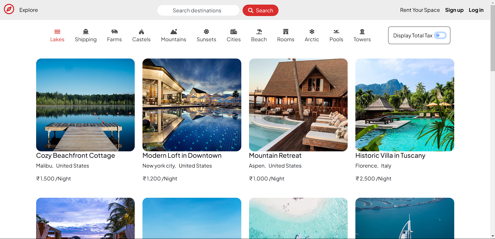
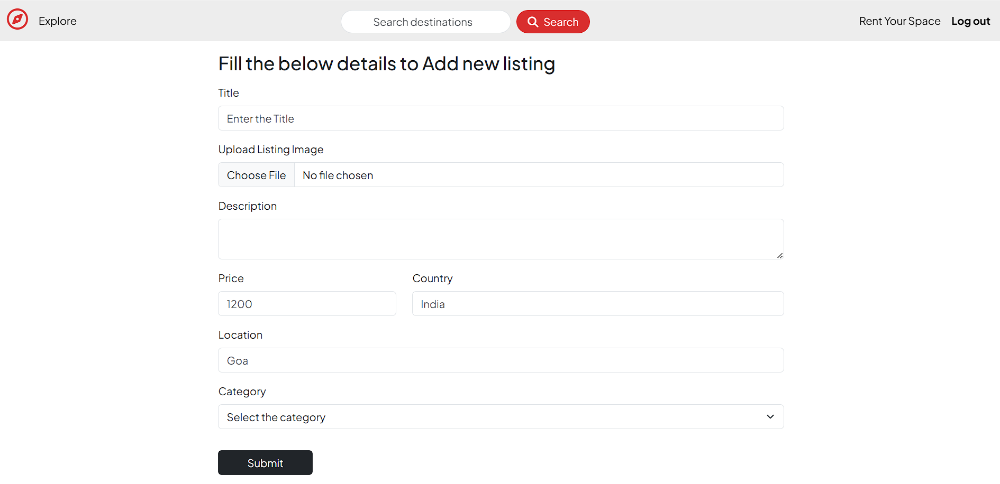

# 🏡 Travelhub — Airbnb Clone Web Application using MERN

A full-stack web application inspired by Airbnb, built using **Node.js**, **Express**, **MongoDB**, and **EJS templating**. Users can browse, create, and manage property listings with image uploads and responsive UI.

> Booking functionality is not included in this version.

---

## 🌐 Live Demo

[🔗 Live Website](https://major-project-rvu0.onrender.com/listings)

---

## 💠 Tech Stack

### Frontend

* **EJS** (Embedded JavaScript Templates)
* **Bootstrap 5** for responsive and mobile-friendly UI
* **JavaScript** for interactivity

### Backend

* **Node.js** with **Express.js**
* **MongoDB** with **Mongoose**
* **Multer + Cloudinary** for image upload and hosting
* **Express-session** and **Passport.js** for authentication

### Deployment

* **Render** for backend deployment
* **Cloudinary** for image management

---

## ✨ Features

* 👤 **User Authentication** (Register / Login / Logout)
* 🏠 **Create, Read, Update, Delete** property listings
* 📷 **Upload images** using Cloudinary
* 📱 **Responsive UI** with Bootstrap
* 🗂 **Host Dashboard** to manage listings
* ❌ **Booking not implemented** (can be added later)

---

## 📸 Screenshots

| Homepage                        | Add Listing                           |
| ------------------------------- | ------------------------------------- |
|  |  |

*Place your actual screenshots in the `screenshots/` folder.*

---

## 🧰 Getting Started

### 1. Clone the Repository

```bash
git clone https://github.com/Karthik-V1/Major-Project-clone.git
cd Major-Project-clone
```

### 2. Install Dependencies

```bash
npm install
```

### 3. Configure Environment Variables

Create a `.env` file in the root directory:

```env
PORT=3000
MONGO_URI=your_mongo_db_connection_string
SESSION_SECRET=your_session_secret
CLOUDINARY_CLOUD_NAME=your_cloud_name
CLOUDINARY_API_KEY=your_api_key
CLOUDINARY_API_SECRET=your_api_secret
```

### 4. Run the Application

```bash
npm run dev
```

Visit `http://localhost:3000` in your browser.

---

## 🧐 Future Enhancements

* ✅ Implement booking and availability system
* 💳 Integrate payment gateway (Stripe or Razorpay)
* 📊 Admin panel with analytics
* 🛈 Messaging between host and guest

---

## 👤 Author

**Karthik V**
[Portfolio](https://v0-myportfolio-eight.vercel.app) • [GitHub](https://github.com/Karthik-V1) • [LinkedIn](https://www.linkedin.com/in/karthik-v-94b00724a/)

---

## 📄 License

This project is open-source under the [MIT License](LICENSE).
